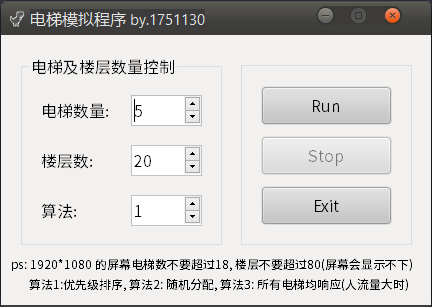
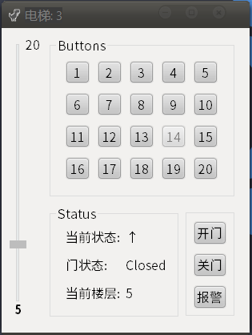

# 处理机管理-电梯调度

操作系统 课程作业 1 

----
## 项目背景及需求
某一层楼20层，有五部互联的电梯。基于线程思想，编写一个电梯调度程序。
每个电梯里面设置必要功能键：如数字键、关门键、开门键、上行键、下行键、报警键、当前电梯的楼层数、上升及下降状态等。
每层楼的每部电梯门口，应该有上行和下行按钮和当前电梯状态的数码显示器。
五部电梯门口的按钮是互联结的，即当一个电梯按钮按下去时，其他电梯的相应按钮也就同时点亮，表示也按下去了。
所有电梯初始状态都在第一层。每个电梯如果在它的上层或者下层没有相应请求情况下，则应该在原地保持不动。

## 开发/运行环境
```
    环境: Windows 10 1809
    语言: C++ / MinGW x64 8.1.0 / Qt 5.12.0
```

## 系统架构

### 整体架构
#### 项目文件:
```bash
    └─elevator
        │  building.cpp
        │  building.h
        │  building.ui
        │  elevator.cpp
        │  elevator.h
        │  elevator.ui
        │  elevator_sim.pro
        │  elevator_sim.pro.user
        │  icon.ico
        │  main.cpp
        │  mainwindow.cpp
        │  mainwindow.h
        │  mainwindow.ui
        │  README.md
        │
        └─release
            │  elevator_sim.exe
            │  Qt5Core.dll
            │  Qt5Gui.dll
            │  Qt5Widgets.dll
            │
            ├─platforms
            │      qwindows.dll
            │
            └─styles
                    qwindowsvistastyle.dll
```
#### 架构:
项目包含三个类: 主窗口类 `mainwindow`, 电梯类 `elevator`, 控制台类 `building`, 每个类均有自己的界面实现. 程序运行后, 实例化一个 `mainwindow` 类. 调整电梯与楼层的数量后, `mainwindow` 的 `run()` 方法实例化若干个 `elevator` 类和一个 `building` 类. 前者包括了电梯内部的楼层按钮与显示, 后者包括了电梯外部每一层楼的按钮以及每个电梯状态的显示.

运行截图如下所示: 


### mainwindow 
>程序主窗口, 继承自 `QMainWindow` 类



#### 界面元素
1. `Run`: 运行模拟
2. `Stop`: 停止模拟并销毁所有其他窗口
3. `Exit`, `X`: 销毁所有其他窗口之后退出
4. `算法选择框`: 选择外部分派算法, 共有三种算法, 在后文有详细叙述

#### 主要内部方法
```c++
	void run();      // To start simiulations.
	void my_stop(); // To stop simiulations.
```

### elevator 类
>电梯窗口, 继承自 `QWidget` 类
每 800ms 刷新一次状态



#### 界面元素
1. `Slider`: 用于指示电梯当前位置, 不可滑动. 上方标签为最大楼层, 下方标签为当前楼层.
2. `Buttons`: 模拟电梯内部选择楼层的按钮, 按钮为灰色代表此楼层已按下.
3. `当前状态`: 共有三种状态, 停止: `P`, 上升: `↑`, 下降: `↓`;
4. `门状态`: 共有四种, `"Closed`, `Opened`, `Closing`, `Opening"`
5. `开门`: 电梯正在运行时, 无法进行操作.

#### 主要内部方法
```c++
    void open_door();
    void renew_label();
    void check_when_run();
    void check_when_pause();
    void timer_elevator_tick(); // Run every ELEVATOR_TIMER_TICK ms.
    void cancel_request(int floor);
    // Recive task request form outside(building), and add it to destO. .
    // See "send_request()" in class "building".
    bool recive_request(bool up = true, int floor = 1, bool forceRecive = false);
```

### building 类
>外部控制窗口, 模拟电梯外部的操作, 继承自 `QWidget` 类
每 100ms 刷新一次状态


#### 界面元素
1. `Elevators`: 显示所有电梯当前的状态
2. `Floor Buttons`: 每一层楼的上行和下行按钮
3. `状态栏`: 显示调度操作

#### 主要内部方法


## 调度算法
### 内部调度算法
### 内部调度实现
### 外部调度算法
### 外部调度实现